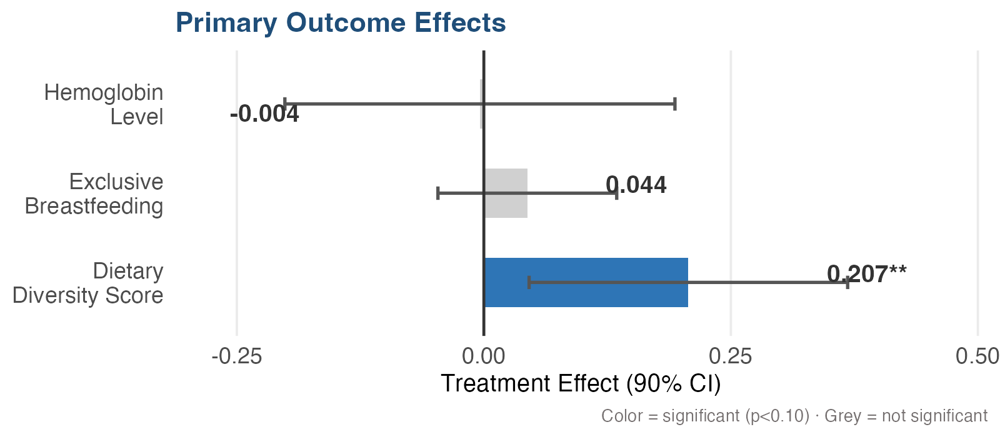
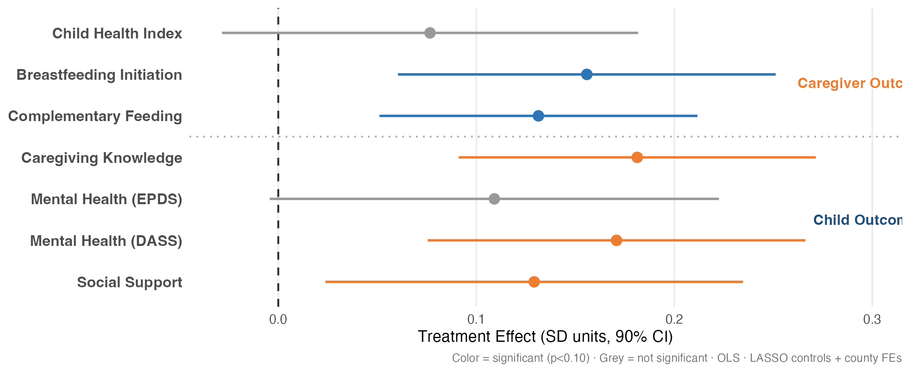
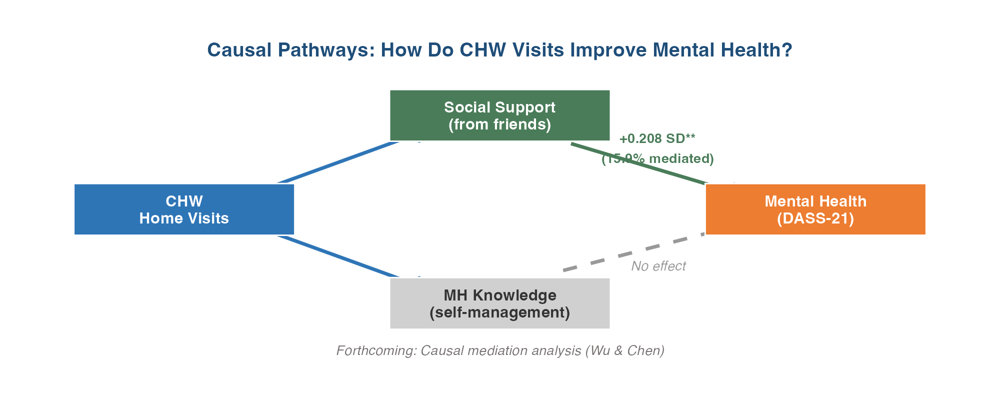

## Talk Outline

::: {.eyebrow}
ROADMAP
:::

1. **The Problem** -- CHWs face impossible content decisions in limited time

2. **The Healthy Future Program** -- Curriculum, platform, and open-source infrastructure

3. **Evidence from HF 1.0** -- RCT results across nutrition, mental health, and social support

4. **Mechanisms** -- Social support, family engagement, and dose-response

5. **The Case for Personalization** -- HTE analysis and the content allocation problem

6. **HF 2.0** -- Algorithm vs. family choice for content personalization

::: {.notes}
[~30 sec] Quick roadmap. Three acts: evidence, mechanisms, and the path to personalization.
:::

## The Problem: One Visit, Many Needs

::: {.eyebrow}
CONTEXT
:::

:::: {.columns}
::: {.column width="50%"}

A CHW has **30-60 minutes per home visit** to address:

- Breastfeeding -- initiation, exclusivity, timing
- Complementary feeding -- diversity, frequency
- Maternal mental health -- depression, anxiety, stress
- Health service uptake -- vaccines, checkups
- Sanitation and safety
- **Stimulation** -- responsive caregiving, early learning
- **MORE...**

:::
::: {.column width="50%"}

::: {.callout-important}
### The Standard Approach
Every family at the same developmental stage gets the **same content** -- regardless of their specific needs or circumstances.
:::

:::
::::

::: {.notes}
[~1.5 min] The core tension: families have diverse, evolving needs but CHWs deliver a one-size-fits-all curriculum. This is the problem we set out to solve.
:::

## The Healthy Future Program

::: {.eyebrow}
THE INTERVENTION
:::

:::: {.columns}
::: {.column width="70%"}

::: {style="font-size: 0.99em;"}

A comprehensive, digitally-enabled community health program addressing the holistic needs of mothers and children from pregnancy through 18 months.

**Three core components:**

- **Stage-based curriculum** -- 26 sessions across 6 content domains, timed to developmental stage
- **CHW home visits** -- 30-60 min monthly visits by trained local health workers
- **Digital platform** -- tablet app + admin portal that automates content assignment, scheduling, and monitoring

:::

:::
::: {.column width="30%"}

{fig-align="center" width="50%" fig-alt="Healthy Future Program curriculum cover"}

:::
::::

::: {.notes}
[~1 min] Three things make this different from typical CHW programs: the curriculum is stage-based, it's delivered through a structured app, and both are freely available. Quick overview -- next two slides go deeper on content and platform.
:::

## What CHWs Deliver: 26 Sessions Across 6 Domains

::: {.eyebrow}
CURRICULUM
:::

:::: {.columns}
::: {.column width="85%"}

{fig-align="center" width="120%" fig-alt="Timeline showing intervention modules from pregnancy through 18 months covering breastfeeding, complementary feeding, preventive care, nutrition, mental health, and health services"}

:::
::: {.column width="10%"}

**Completion:** 82% participated. Median **12 visits**. Median duration: **32 min**.

**Avg sessions:**

- Breastfeeding: 7.5
- Comp. feeding: 6.7
- Preventive: 6.5
- Mental health: 5.2

:::
::::

::: {.notes}
[~1.5 min] Walk through the figure. Content evolves across stages. The app decides what to deliver at each visit based on developmental stage and prior coverage. CHW focuses on delivery, not logistics.
:::

## The Healthy Future Platform

::: {.eyebrow}
DIGITAL INFRASTRUCTURE
:::

:::: {.columns}
::: {.column width="60%"}
::: {.fragment}

#### Tablet App (CHW-facing)

- Automated content assignment by developmental stage
- Structured visit workflow with scripted delivery
- Real-time data capture (participation, knowledge checks, survey responses)
- Offline-first -- works in rural, low-connectivity settings

#### Admin Portal (Supervisor-facing)

- Remote monitoring of visit frequency, duration, quality
- Early detection of implementation issues
- Supervisory feedback loop

:::
:::
::: {.column width="40%"}
::: {.fragment}

### Key Design Principles

::: {.callout-tip}
The app **removes the logistical burden** from CHWs. They focus on interpersonal delivery; the platform handles what content, when, and tracking.
:::

### Built for Adaptation

- Modular curriculum architecture
- Any structured curriculum can be loaded
- Can add any language: Currently Mandarin & English

:::
:::
::::

::: {.notes}
[~1 min] The platform is the key enabler. It's what makes the program scalable and what creates the opportunity for personalization later. Two components: the CHW tablet app and the supervisor admin portal.
:::

## Open Source and Extensible

::: {.eyebrow}
PUBLIC GOODS
:::

:::: {.columns}
::: {.column width="50%"}

### CareLoom Platform

- **MIT License** -- fully open-source
- [github.com/DHEPLab](https://github.com/DHEPLab)
- General-purpose: can host any modularized curriculum
- Carolina Population Center grant to localize (English language, extension frameworks)

### Healthy Future Curriculum

- **CC BY-NC 4.0** -- free for non-commercial use
- 26 sessions, fully scripted with activities and videos
- Developed with Stanford REAP, local health systems, and community input

:::
::: {.column width="50%"}

### Future Vision

- **Hackathon** with developers across China to build extensions and adaptations
- Framework for other countries/contexts to adapt curriculum
- Integration with national CHW programs

::: {.callout-note}
The goal: a reusable infrastructure that other teams can adopt without starting from scratch.
:::

:::
::::

::: {.notes}
[~1 min] Both the software and curriculum are public goods. The platform is general-purpose -- any structured curriculum can be loaded. We're working on English localization and extensibility with a CPC grant. Future: hackathon with developers, adaptation framework for other contexts.
:::

## {.center}

::: {style="text-align: center; padding: 1em;"}

### Healthy Future Home Visit

<iframe src="https://canva.link/otaxx4z8kq8086z" width="1200" height="675" frameborder="0" allowfullscreen></iframe>

[**Open full video →**](https://canva.link/otaxx4z8kq8086z){target="_blank"}

:::

::: {.notes}
[~1 min] Quick demo video showing the app in action during a CHW home visit. Show how the app guides the visit, presents content, and captures data.
:::

## Study Design

::: {.eyebrow}
CLUSTER RCT -- RURAL CHINA
:::

:::: {.columns}
::: {.column width="48%"}

**119 rural townships** in four poor counties, Sichuan Province

- **40 treatment** / **79 control** townships
- **1,306 families** enrolled (pregnancy through infancy <6mo)
- **12 months** of CHW home visits
- **88% follow-up** rate (despite COVID-19 disruptions)
- 40 CHWs -- one per treatment township, all female, mean age 34.6

:::
::: {.column width="52%"}

{fig-align="center" width="95%" fig-alt="Bar chart of baseline characteristics: 32% exclusive breastfeeding, 43% any mental health concern, 19% depression, 21% anxiety"}

:::
::::

::: {.callout-note style="font-size: 0.85em;"}
Post-double-selection LASSO for covariate selection · County fixed effects · Township-clustered standard errors · IPW for differential completion · FDR-adjusted q-values
:::

::: {.notes}
[~1.5 min] Large-scale cluster RCT, well-powered, high follow-up despite COVID. Baseline shows dual challenge: poor feeding practices AND high mental health burden.
:::

## Primary Outcomes

::: {.eyebrow}
PRE-SPECIFIED
:::

{fig-align="center" width="85%" fig-alt="Horizontal bar chart showing treatment effects on three primary outcomes: hemoglobin (null), exclusive breastfeeding (null), dietary diversity (significant, +0.207)"}

::: {.callout-note style="font-size: 0.95em;"}
**Why dietary diversity?** Behavioral changes in feeding practices are the most responsive outcome at 12 months. Hemoglobin needs longer follow-up; exclusive BF was underpowered (only 210 infants <6mo at follow-up due to COVID timing). The secondary outcomes tell a richer story.
:::

::: {.notes}
[~1.5 min] Be upfront: two of three primary outcomes are null. But explain why. Dietary diversity is the proximate win. The secondary outcomes are where the program really shines.
:::

## Secondary Outcomes: Where We See the Impact

::: {.eyebrow}
DOMAIN-LEVEL EFFECTS
:::

{fig-align="center" width="95%" fig-alt="Forest plot showing treatment effects across child outcomes and caregiver outcomes with 90% CIs"}

**The story:** Behavioral improvements in feeding and breastfeeding initiation, paired with substantial gains in caregiver knowledge and mental health. 

::: {.notes}
[~1.5 min] Strongest slide. Walk left to right: child outcomes show feeding improvements, caregiver outcomes show knowledge + mental health + social support gains. The breadth reflects the comprehensive design.
:::

## How Does It Work? Social Support, Not Knowledge

::: {.eyebrow}
MECHANISM
:::

{fig-align="center" width="90%" fig-alt="DAG showing CHW home visits leading to mental health improvement through social support pathway (significant) but not through mental health knowledge pathway (null)"}

:::: {.columns}
::: {.column width="50%"}

### Mental health improved significantly

- Depression: **-6.3 pp** (p = 0.008)
- Anxiety: **-4.9 pp** (p = 0.020)
- Stress: **-4.2 pp** (p = 0.039)

:::
::: {.column width="50%"}

::: {.callout-tip}
### The Insight
Regular CHW home visits functioned as **consistent interpersonal contact and emotional reassurance** -- the social connection itself was therapeutic.
:::

*Forthcoming: Causal mediation analysis (Wu & Chen)*

:::
::::

::: {.notes}
[~1.5 min] Counterintuitive and memorable. Mental health improved, but NOT through knowledge. Knowledge scores didn't budge. Instead, the social support from regular visits was the mechanism. 15.9% of the effect flows through perceived social support from friends. The structured visits created a relationship.
:::

## Does Family Engagement Matter?

::: {.eyebrow}
ENCOURAGEMENT DESIGN
:::

::: fragment

### Encouragement design?

Within the 40 treatment townships, we randomly assigned half to **encourage secondary caregiver participation** (typically grandmothers). 
**Only difference:** CHWs in T2 townships promoted joint participation. 

**Exogenous variation in *who* participates**, allowing us to estimate the causal effect of family engagement.

:::

::: fragment

:::: {.columns}
::: {.column width="50%"}

### The encouragement worked

| | Standard (T1) | Encouragement (T2) |
|---|---|---|
| Secondary caregiver participation | 21% | **45%** |
| Joint visits | 19% | **43%** |
| Take-up rate | 84% | 82% |
| Avg visits completed | 11.1 | 10.5 |

:::
::: {.column width="50%"}

### Dose-response (IV estimates)

Each additional home visit improves outcomes:

| Visit type | Feeding | MH (DASS) |
|------------|---------|-----------|
| Primary alone | +0.028 SD | **-4.1 pts** |
| Joint visit | +0.048 SD | -5.9 pts |

Joint visits: **~1.7x the effect** on feeding

:::
::::

:::

::: {.notes}
[~2 min] Progressive reveal. First explain the design -- this is an encouragement design, a standard method for estimating effects of behaviors we can't directly randomize. Then show it worked: secondary caregiver participation more than doubled. Then the dose-response: using assignment as an instrument, each joint visit has roughly 1.7x the effect of a solo visit. Underpowered for the comparison (p=0.12) but consistent with social support mechanism.
:::

## HF 1.0 Works -- But Can We Do Better?

::: {.eyebrow}
THE SCALING CHALLENGE
:::

:::: {.columns}
::: {.column width="70%"}

#### Limiting Constraints

- **Time:** 30-60 minutes per visit, monthly
- **Cognitive bandwidth:** Families can only absorb so much per session
- **Content volume:** 26 sessions, 6 domains

#### The wish list keeps growing...

- Early stimulation and responsive parenting integration
- Expanded nutrition content for complementary feeding
- Stronger mental health support modules

:::
::: {.column width="30%"}

### The core tension

**More Content vs. CHW/Caregiver Capacity**

Every additional module competes for limited visit time and CHW bandwidth. Standard delivery can't scale content without scaling burden.

:::
::::

::: {.notes}
[~1.5 min] HF 1.0 works, but there are real constraints. We want to integrate stimulation, expand nutrition content, strengthen mental health support -- but CHWs only have 30-60 minutes. The current model delivers the same sequence to everyone. Adding more content with this approach creates overload.
:::

## Digital Infrastructure Enables Personalization

::: {.eyebrow}
THE OPPORTUNITY
:::

:::: {.columns}
::: {.column width="50%"}

### The CareLoom platform already:

- Assigns content by developmental stage
- Tracks what each family has covered
- Captures post-visit survey responses and knowledge checks

### What it COULD do:

- **Personalize** which modules get priority based on family needs
- Create a **learning loop** -- use intermediate outcomes after each visit to improve delivery over time
- **Expand content** without increasing CHW burden -- the algorithm handles prioritization

:::
::: {.column width="50%"}

::: {.callout-tip}
### Can we use digital infrastructure to enable **personalization**?  
While maintaining standardization and **impelmentaiton fidelity** and 
**without creating more burden** for CHWs & families.
:::

#### Learning loop

Visit data (knowledge checks, survey responses, participation) --> 

Platform learns which content combinations work best for which families -->

and adjusts and improves over time

:::
::::

::: {.notes}
[~1.5 min] The platform is already collecting the data needed for personalization. After each visit, knowledge checks and survey responses flow back. In principle, this creates a learning loop -- the system can improve over time. The key: personalization doesn't mean less standardization. It means the same rigorous delivery process, but with smarter content selection.
:::

## Is There Room to Personalize?

::: {.eyebrow}
HETEROGENEOUS TREATMENT EFFECTS
:::

:::: {.columns}
::: {.column width="55%"}

### BLP heterogeneity tests 

| Outcome domain | BLP p-value | Heterogeneity? |
|---------------|------------|----------------|
| Child nutrition (6 outcomes) | 0.28 -- 0.91 | No |
| Breastfeeding (2 outcomes) | 0.34 -- 0.67 | No |
| Child health index | 0.44 | No |
| Social support | 0.52 | No |
| **Caregiver MH (DASS)** | **0.071** | **Suggestive** |
| MH factor score | 0.184 | Marginal |

:::
::: {.column width="45%"}

We screened **12 outcomes** for treatment effect heterogeneity using machine learning (causal forests with 4,000 trees)

**Very little variation in the effects of the intervention across families**

#### What does this tell us?

:::
::::

::: {.notes}
[~1.5 min] We looked hard for heterogeneity. Answer: almost none. Only mental health shows suggestive heterogeneity. Good news for equity. But it also means personalization isn't about targeting families -- it's about something else.
:::

## Not Which Families -- Which Content

::: {.eyebrow}
THE PERSONALIZATION INSIGHT
:::

:::: {.columns}
::: {.column width="50%"}

### What the HTE analysis tells us

- Limited heterogeneity across families means **targeting families** is not the path to improvement
- The program already works equitably

### But effects DO vary across domains

- Strong: feeding practices, mental health, social support
- Weak: hemoglobin, exclusive breastfeeding, anthropometrics
- And families have **different baseline needs**

:::
::: {.column width="50%"}

::: {.callout-tip}
### The Opportunity
Personalize **which content** gets priority in each visit -- not which families receive the program.
:::

Given time and bandwidth constraints, the question becomes:

**For this family, at this visit, which of the available modules would generate the most benefit?**

This is a content allocation problem, not a targeting problem.

:::
::::

::: {.notes}
[~1.5 min] The pivot. Most personalization in public health is about targeting. Our data says that's not the opportunity here. The question is about content: given 30-60 minutes, which modules should be prioritized for this family?
:::

## HF 2.0: How Do You Personalize Content?

::: {.eyebrow}
NEXT STEPS
:::

:::: {.columns}
::: {.column width="50%"}

### The challenge

Recommender algorithms (Netflix, Amazon) learn from **millions of interactions daily**. Community health programs don't have that scale or runway.

### Two candidate approaches

**Algorithmic prioritization**
An algorithm selects modules based on family characteristics, visit history, and predicted benefit

**Family choice**
Families choose from a menu of available modules for their next visit -- leveraging their own knowledge of what they need most

:::
::: {.column width="50%"}

### Open questions

- Does algorithmic selection outperform family self-selection?
- Can we train an effective algorithm with hundreds (not millions) of families?
- Does giving families choice increase engagement and ownership?
- Or does choice create decision fatigue and reduce fidelity?

::: {.callout-important}
### Planned: Head-to-Head Trial
HF 2.0 will test **algorithm vs. family choice vs. standard delivery** to determine the most effective approach to content personalization.
:::

:::
::::

::: {.notes}
[~1.5 min] The intellectual payoff. Two natural approaches: let an algorithm decide, or let families decide. Each has advantages and risks. The next phase is a head-to-head trial.
:::

## Summary

::: {.eyebrow}
KEY TAKEAWAYS
:::

1. **HF 1.0 works** -- digitally-enabled CHW home visits improve feeding practices, caregiver knowledge, and mental health across multiple domains simultaneously

2. **The mechanism is social connection** -- mental health gains came through structured interpersonal contact, not mental health knowledge transfer

3. **Personalization is about content, not targeting** -- treatment effects are equitable across families, so the opportunity is optimizing *what* gets delivered, not *to whom*

4. **Digital infrastructure makes this possible** -- the same platform that ensures fidelity can also enable personalization at scale

:::: {.columns}
::: {.column width="60%"}

### Thank you

Open-source platform: [github.com/DHEPLab](https://github.com/DHEPLab)

:::
::: {.column width="40%"}

{width="180px"}

**Sean Sylvia, Ph.D.**
ssylvia@unc.edu

:::
::::

::: {.notes}
Leave up during Q&A. Four takeaways map to the narrative arc: evidence, mechanism, personalization insight, infrastructure.
:::

# Appendix {.center}

## A1 -- Post-Double-Selection LASSO

**Why this method?**

- Standard RCT regression: add pre-specified controls; risk of omitting important predictors
- PDS-LASSO runs two separate LASSO procedures (on outcome and treatment) to identify strong baseline predictors; includes those in the final regression
- Result: improved statistical power, reduced SEs, without arbitrary variable selection
- In HF: baseline maternal dietary diversity was selected -- controlling for it substantially reduced SEs on DDS (p: 0.051 to 0.035)

## A2 -- Surrogate Index Framework

**Technical details (Athey et al. 2019)**

Construct a composite $S$ of short-run outcomes that together predict long-run outcome $Y$ in the control group:

$$E[Y \mid X, T] \approx E[E[Y \mid S, X] \mid X, T]$$

**In HF context -- candidate surrogates:**

- Dietary diversity score, breastfeeding practices, caregiver knowledge, depression score, social support

**HF 2.0 Phase 1:** Formally estimate surrogate index; validate on HF 1.0 control group data; use as optimization target for content recommendation algorithm.

## A3 -- Heterogeneous Effects: Causal Forest Analysis

{fig-align="center" width="95%" fig-alt="Two-panel figure: CATE distribution histogram and variable importance bar chart"}

::: {.callout-note}
**Equity finding:** Across 12 outcomes screened, only caregiver mental health (DASS) shows marginally detectable heterogeneity (BLP p = 0.07). All child nutrition outcomes show **no heterogeneity**. Universal delivery works; HF 2.0 should personalize *content*, not *who to treat*.
:::

## A4 -- Heterogeneity Screening: Domain Summary Indices

| Index | Components | N | BLP p |
|-------|-----------|---|-------|
| Mental Health | EPDS + DASS | 816 | 0.071 |
| Caregiver Support | SS + Knowledge | 956 | 0.52 |
| Child Nutrition | Child Health + CF + BFI | 938 | 0.44 |

Anderson (2008) ICW indices. Causal forest: 4,000 trees, tuned. See `hf_heterogeneity.html` for full results.

## A5 -- From Heterogeneity to Equity: Two Studies

:::: {.columns}
::: {.column width="50%"}

### Sylvia et al. (2021) -- Parenting Intervention

{width="90%" fig-alt="Bimodal CATE distribution showing significant heterogeneity"}

::: {.callout-note style="font-size: 0.85em;"}
**Significant heterogeneity.** Disadvantaged children benefited **+0.46 SD more**. Top predictor: baseline parental investment.
:::

:::
::: {.column width="50%"}

### Healthy Future 1.0 -- This Study

{width="90%" fig-alt="Compressed CATE distribution showing equitable effects"}

::: {.callout-note style="font-size: 0.85em;"}
**No significant heterogeneity** across 12 outcomes. The program benefits **all families similarly** -- an equity finding.
:::

:::
::::

*App-guided delivery equalizes outcomes across family types -- a design feature, not a limitation.*

## A6 -- Encouragement Design: ITT by Treatment Arm

:::: {.columns}
::: {.column width="50%"}

### Mental Health (DASS-21) by Arm

| Outcome | T1 vs C | T2 vs C |
|---------|---------|---------|
| Total DASS-21 | **-3.22*** | -2.12 |
| Depression | **-1.05*** | -0.58 |
| Anxiety | **-0.87*** | -0.39 |
| Stress | **-1.33*** | -1.17 |

T1 (standard) shows stronger ITT mental health effects.

:::
::: {.column width="50%"}

### But the comparison is nuanced

- Study NOT powered for T1 vs T2 (20 vs 20 townships)
- All equality tests insignificant
- T2 had slightly fewer visits (10.5 vs 11.1)
- IV dose-response suggests joint visits may be MORE effective per visit

::: {.callout-note style="font-size: 0.85em;"}
The ITT pattern does not mean family engagement hurts. The dose-response tells a different story: **each joint visit has ~1.7x the effect** of a solo visit.
:::

:::
::::
