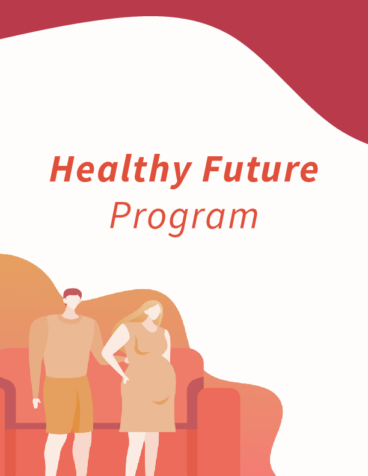
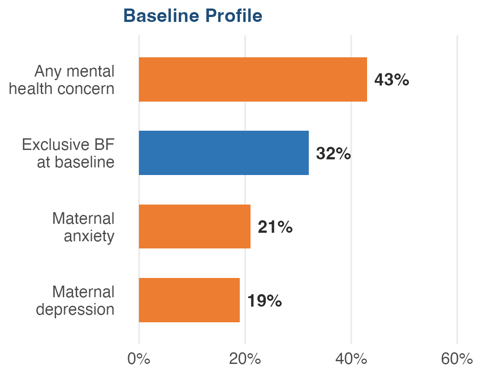
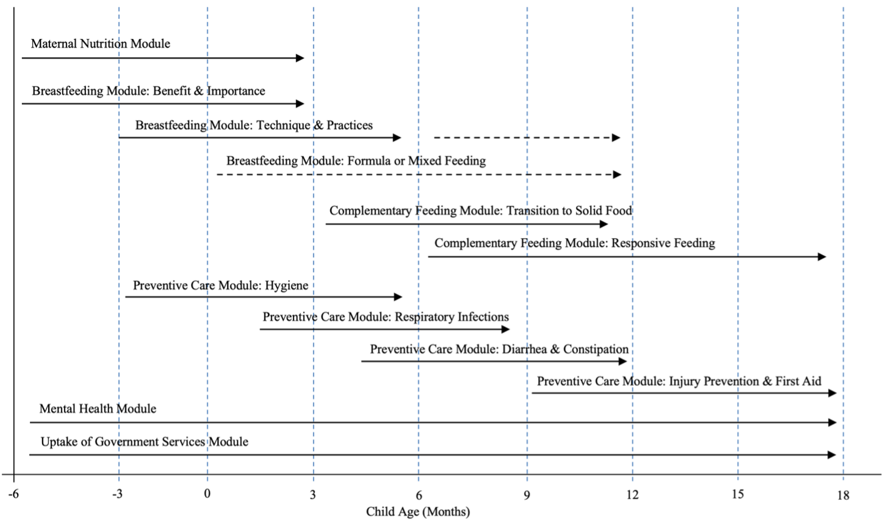
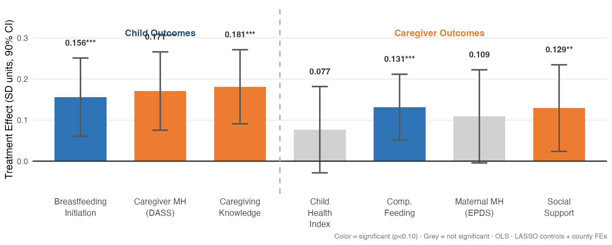
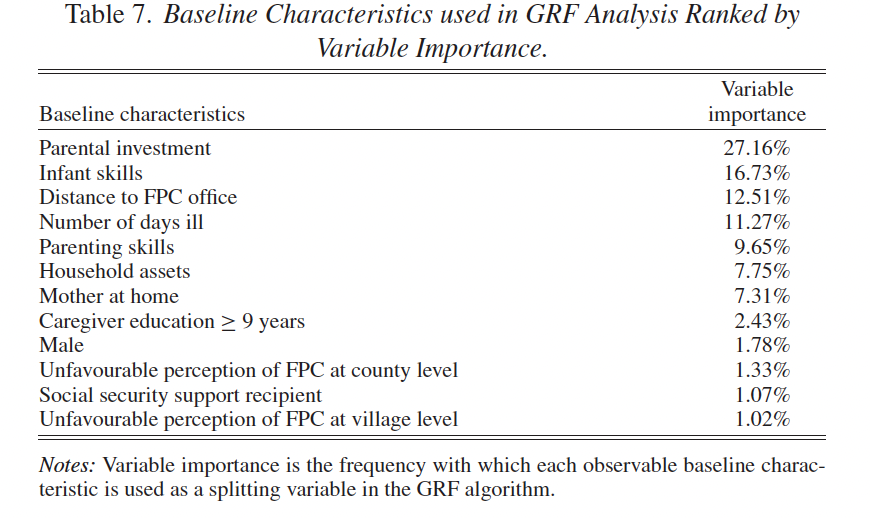
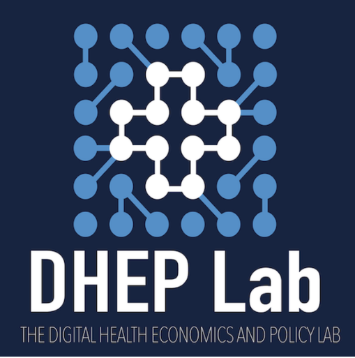
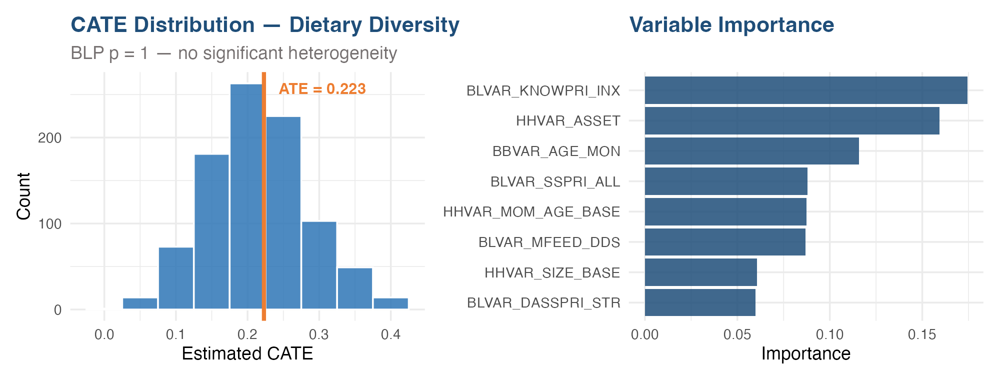
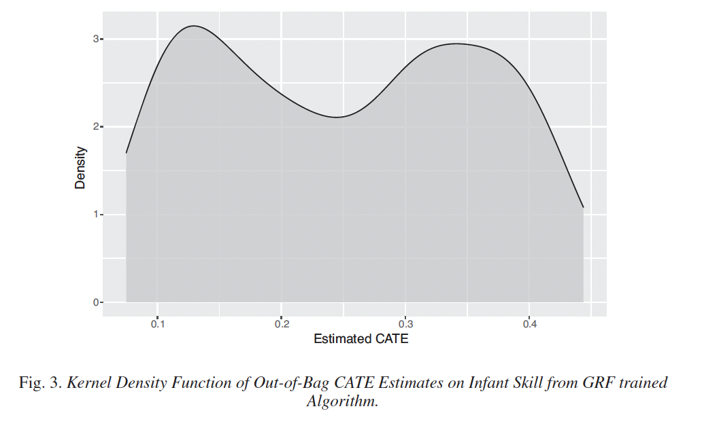
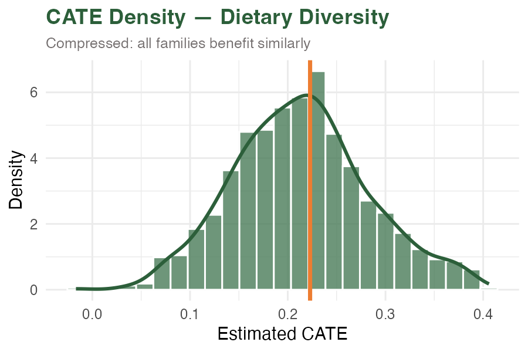

## The Problem: One Visit, Many Needs

::: {.eyebrow}
CONTEXT
:::

:::: {.columns}
::: {.column width="50%"}

A CHW has **30-60 minutes per home visit** to address:

- Breastfeeding — initiation, exclusivity, timing
- Complementary feeding — diversity, frequency
- Maternal mental health — depression, anxiety, stress
- Health service uptake — vaccines, checkups
- Daily care and stimulation — responsive caregiving

:::
::: {.column width="50%"}

::: {.callout-important}
### The Standard Approach
Every family at the same developmental stage gets the **same content** — regardless of their specific needs or circumstances.
:::

**30-60 minutes · dozens of families · hundreds of content decisions**

:::
::::

::: {.notes}
[~1.5 min] The core tension: families have diverse, evolving needs but CHWs deliver a one-size-fits-all curriculum. This is the problem we set out to solve.
:::

## The Healthy Future Program

::: {.eyebrow}
THE INTERVENTION
:::

:::: {.columns}
::: {.column width="50%"}

A comprehensive, digitally-enabled community health program addressing the holistic needs of mothers and children from pregnancy through 18 months.

**Three core components:**

- **Stage-based curriculum** — content timed to developmental stage, not one-size-fits-all
- **CHW home visits** — 30-60 min monthly visits by trained local health workers
- **CareLoom app** — tablet-based platform that automates content assignment, scheduling, and monitoring

::: {.callout-note}
### Open Source
CareLoom is MIT-licensed ([github.com/DHEPLab](https://github.com/DHEPLab)) and the full curriculum is CC BY-NC licensed.
:::

[**See the app in action →**](https://canva.link/otaxx4z8kq8086z){target="_blank"}

:::
::: {.column width="50%"}

{fig-align="center" width="85%" fig-alt="Healthy Future Program curriculum cover showing illustrated pregnant couple"}

:::
::::

::: {.notes}
[~1.5 min] Three things make this different from typical CHW programs: the curriculum is stage-based (content evolves with the child), it's delivered through a structured app that handles logistics, and both the software and curriculum are freely available. The app is the key — it removes the burden of deciding what to teach from the CHW.
:::

## Study Design

::: {.eyebrow}
CLUSTER RCT — RURAL CHINA
:::

:::: {.columns}
::: {.column width="48%"}

**119 rural townships** in four poverty-stricken counties, Sichuan Province

- **40 treatment** / **79 control** townships
- **1,306 families** enrolled (pregnancy through infancy <6mo)
- **12 months** of CHW home visits
- **88% follow-up** rate (despite COVID-19 disruptions)
- 40 CHWs — one per treatment township, all female, mean age 34.6

:::
::: {.column width="52%"}

<!-- TODO: Pre-render baseline bar chart from original R code as images/hf-baseline-chart.png -->
<!-- Shows: 32% exclusive BF, 43% any MH concern, 19% depression, 21% anxiety -->
{fig-align="center" width="95%" fig-alt="Bar chart of baseline characteristics: 32% exclusive breastfeeding, 43% any mental health concern, 19% depression, 21% anxiety"}

:::
::::

::: {.callout-note style="font-size: 0.85em;"}
Post-double-selection LASSO for covariate selection · County fixed effects · Township-clustered standard errors · IPW for differential completion · FDR-adjusted q-values
:::

::: {.notes}
[~1.5 min] Key points: this is a large-scale cluster RCT, well-powered, with high follow-up despite COVID. The baseline profile shows the dual challenge — poor feeding practices AND high mental health burden. Methods note is there for the economists in the room but don't dwell on it.
:::

## What CHWs Deliver: 26 Sessions Across 6 Domains

::: {.eyebrow}
CURRICULUM
:::

{fig-align="center" width="95%" fig-alt="Timeline showing intervention modules from pregnancy through 18 months covering breastfeeding, complementary feeding, preventive care, nutrition, mental health, and health services"}

:::: {.columns}
::: {.column width="55%"}

::: {.callout-note style="font-size: 0.9em;"}
**Completion:** 82% participated. Families received a median of **12 home visits** (mean 10.5) over 12 months. Median visit duration: **32 minutes**.
:::

:::
::: {.column width="45%"}

**Most delivered modules (avg sessions):**

- Breastfeeding: 7.5
- Complementary feeding: 6.7
- Preventive health: 6.5
- Mental health: 5.2

:::
::::

::: {.notes}
[~1.5 min] Walk through the figure — show how content evolves across stages. Emphasize: the app decides what content to deliver at each visit based on the child's developmental stage and what the family has already covered. The CHW focuses on delivery, not logistics.
:::

## Primary Outcomes

::: {.eyebrow}
PRE-SPECIFIED
:::

:::: {.columns}
::: {.column width="33%"}

### Hemoglobin

**No effect**

p = 0.97

::: {style="font-size: 0.8em; color: #64748B; margin-top: 0.5em;"}
Biomarker outcomes need longer time horizons
:::

:::
::: {.column width="33%"}

### Exclusive Breastfeeding

**No effect**

p = 0.42

::: {style="font-size: 0.8em; color: #64748B; margin-top: 0.5em;"}
Underpowered — only 210 infants <6mo at follow-up
:::

:::
::: {.column width="34%"}

### Dietary Diversity

**+0.207 food groups** (p = 0.035)

::: {style="font-size: 0.8em; color: #64748B; margin-top: 0.5em;"}
Feeding practices are the proximate pathway — where 12-month programs work first
:::

:::
::::

::: {.callout-note style="margin-top: 1.5em; font-size: 0.95em;"}
**Why dietary diversity?** Behavioral changes in feeding practices are the most responsive outcome at 12 months. Biomarker and growth effects require longer follow-up — this is expected, not a failure.
:::

::: {.notes}
[~1.5 min] Be upfront: two of three primary outcomes are null. But explain why — hemoglobin needs longer follow-up, exclusive BF was underpowered due to COVID timing. Dietary diversity is the proximate win, and the secondary outcomes tell a richer story.
:::

## Secondary Outcomes: Where We See the Impact

::: {.eyebrow}
DOMAIN-LEVEL EFFECTS
:::

<!-- TODO: Pre-render grouped bar chart from original R code as images/hf-secondary-outcomes.png -->
{fig-align="center" width="95%" fig-alt="Grouped bar chart showing treatment effects in SD units with 90% CIs across child outcomes (child health, breastfeeding initiation, complementary feeding) and caregiver outcomes (knowledge, EPDS, DASS, social support)"}

::: {.callout-note style="font-size: 0.9em;"}
**The story:** Behavioral improvements in feeding and breastfeeding initiation, paired with substantial gains in caregiver knowledge and mental health. The program works across multiple domains simultaneously — consistent with its integrated design.
:::

::: {.notes}
[~1.5 min] This is the strongest slide. Walk through left to right: child outcomes show feeding improvements, caregiver outcomes show knowledge + mental health + social support gains. The breadth of effects reflects the comprehensive design. Highlight that mental health effects are large and robust — this sets up the next slide.
:::

## How Does It Work? Social Support, Not Knowledge

::: {.eyebrow}
MECHANISM
:::

:::: {.columns}
::: {.column width="50%"}

### Mental health improved significantly

- Depression symptoms: **-6.3 pp** (p = 0.008)
- Anxiety symptoms: **-4.9 pp** (p = 0.020)
- Stress symptoms: **-4.2 pp** (p = 0.039)

### But NOT through mental health knowledge

- Mental health self-management knowledge: **no effect**

:::
::: {.column width="50%"}

### Through social connection

- Perceived social support from friends: **+0.208 SD** (p = 0.028)
- Mediation analysis: **15.9%** of mental health effect flows through social support

::: {.callout-tip}
### The Insight
Regular CHW home visits functioned as a source of **consistent interpersonal contact and emotional reassurance** — the social connection itself was therapeutic.
:::

:::
::::

::: {.notes}
[~1.5 min] This is counterintuitive and memorable. The program improved mental health substantially, but NOT because families learned mental health coping skills. Mental health knowledge scores didn't budge. Instead, having a CHW visit regularly — someone who listens, checks in, provides structure — functioned as social support. The structured visits created a relationship. This matters for how we design HF 2.0.
:::

## Does Family Engagement Matter?

::: {.eyebrow}
ENCOURAGEMENT DESIGN
:::

:::: {.columns}
::: {.column width="50%"}

### Two delivery arms within treatment

- **Standard (T1):** CHW visits primary caregiver only
- **Encouragement (T2):** CHW actively promotes secondary caregiver (typically grandmother) participation

### The encouragement worked

- Secondary caregiver participation: **21% to 45%**
- Joint visits: **19% to 43%**

:::
::: {.column width="50%"}

### Dose-response (IV estimates)

Each additional home visit improves outcomes:

| Visit type | Feeding effect | MH effect (DASS) |
|------------|---------------|-----------------|
| Primary alone | +0.028 SD | -4.1 pts |
| Joint visit | +0.048 SD | -5.9 pts |

Joint visits show **~1.7x the effect** on feeding and larger mental health gains — but study underpowered for the comparison (p = 0.12).

::: {.callout-note style="font-size: 0.85em;"}
Consistent with the social support mechanism — more people in the room, more social connection.
:::

:::
::::

::: {.notes}
[~1.5 min] This connects back to the social support finding. The encouragement design successfully changed who showed up. And the dose-response analysis — using treatment assignment as an instrument — suggests joint visits may be roughly twice as effective per visit. We can't confirm this statistically at this sample size, but the pattern is consistent with social support as the mechanism. More relationships in the room, more benefit.
:::

## The Scaling Challenge

::: {.eyebrow}
FROM HF 1.0 TO HF 2.0
:::

:::: {.columns}
::: {.column width="50%"}

### HF 1.0 demonstrates the program works

But the current model delivers **the same content sequence** to every family at a given stage.

### The constraints are real

- **Time:** 30-60 minutes per visit, monthly
- **Cognitive bandwidth:** Families can only absorb so much per session
- **Content volume:** 26 sessions, 6 domains — not everything is equally relevant to every family

:::
::: {.column width="50%"}

### Digital infrastructure creates an opportunity

The CareLoom app already:

- Assigns content by developmental stage
- Tracks what each family has covered
- Captures post-visit survey responses

::: {.callout-tip}
### The Key Question
Can we use this infrastructure to **personalize content** — delivering what matters most to each family — while maintaining fidelity and scalability?
:::

:::
::::

::: {.notes}
[~1.5 min] Transition slide. We've shown the program works. Now the question: can we do better? The digital infrastructure is already handling logistics — in principle it could also handle personalization. The app knows what stage each family is at, what they've covered, how they responded. The question is how to use that information.
:::

## Is There Room to Personalize?

::: {.eyebrow}
HETEROGENEOUS TREATMENT EFFECTS
:::

:::: {.columns}
::: {.column width="55%"}

We screened **12 outcomes** for treatment effect heterogeneity using causal forests (4,000 trees, honest splitting).

### BLP heterogeneity test results

| Outcome domain | BLP p-value | Heterogeneity? |
|---------------|------------|----------------|
| Child nutrition (6 outcomes) | 0.28 -- 0.91 | No |
| Breastfeeding (2 outcomes) | 0.34 -- 0.67 | No |
| Child health index | 0.44 | No |
| Social support | 0.52 | No |
| **Caregiver MH (DASS)** | **0.071** | **Suggestive** |
| MH factor score | 0.184 | Marginal |

:::
::: {.column width="45%"}

{fig-align="center" width="100%" fig-alt="Variable importance plot from causal forest showing which baseline covariates drive heterogeneity in mental health treatment effects"}

:::
::::

::: {.callout-note style="font-size: 0.95em;"}
**The equity finding:** Unlike teacher incentive programs (Sylvia 2021), where effects concentrated among certain subgroups, the Healthy Future program benefits families **broadly and equitably**. The program works -- and it works for (nearly) everyone.
:::

::: {.notes}
[~1.5 min] This is important for what comes next. We looked hard for heterogeneity — who benefits more, who benefits less. Answer: almost nobody benefits differently. Only mental health shows suggestive heterogeneity. This is good news for equity. But it also means the personalization opportunity isn't about targeting families — it's about something else.
:::

## Not Which Families — Which Content

::: {.eyebrow}
THE PERSONALIZATION INSIGHT
:::

:::: {.columns}
::: {.column width="50%"}

### What the HTE analysis tells us

- Limited heterogeneity across families means **targeting families** is not the path to improvement
- The program already works equitably

### But effects DO vary across domains

- Strong: feeding practices, mental health, social support
- Weak: hemoglobin, exclusive breastfeeding, anthropometrics
- And families have **different baseline needs**

:::
::: {.column width="50%"}

::: {.callout-tip}
### The Opportunity
Personalize **which content** gets priority in each visit — not which families receive the program.
:::

Given time and bandwidth constraints, the question becomes:

**For this family, at this visit, which of the available modules would generate the most benefit?**

This is a content allocation problem, not a targeting problem.

:::
::::

::: {.notes}
[~1.5 min] This is the pivot. Most personalization in public health is about targeting — identify who benefits and focus resources on them. Our data says that's not the opportunity here. Instead, the question is about content: given that a CHW has 30-60 minutes and 3-5 possible modules to deliver, which ones should she prioritize for this particular family? That's a fundamentally different personalization problem.
:::

## HF 2.0: How Do You Personalize Content?

::: {.eyebrow}
NEXT STEPS
:::

:::: {.columns}
::: {.column width="50%"}

### The challenge

Recommender algorithms (Netflix, Amazon) learn from **millions of interactions daily**. Community health programs don't have that scale or runway.

### Two candidate approaches

**Algorithmic prioritization**
An algorithm selects modules based on family characteristics, visit history, and predicted benefit

**Family choice**
Families choose from a menu of available modules for their next visit — leveraging their own knowledge of what they need most

:::
::: {.column width="50%"}

### Open questions

- Does algorithmic selection outperform family self-selection?
- Can we train an effective algorithm with hundreds (not millions) of families?
- Does giving families choice increase engagement and ownership?
- Or does choice create decision fatigue and reduce fidelity?

::: {.callout-important}
### Planned: Head-to-Head Trial
HF 2.0 will test **algorithm vs. family choice vs. standard delivery** to determine the most effective approach to content personalization.
:::

:::
::::

::: {.notes}
[~1.5 min] This is the intellectual payoff. We know the program works. We know personalization should focus on content, not families. The question is HOW to personalize. Two natural approaches — let an algorithm decide, or let families decide. Each has advantages and risks. The next phase of this research is a head-to-head trial. This is where we're heading.
:::

## Summary

::: {.eyebrow}
KEY TAKEAWAYS
:::

1. **HF 1.0 works** — digitally-enabled CHW home visits improve feeding practices, caregiver knowledge, and mental health across multiple domains simultaneously

2. **The mechanism is social connection** — mental health gains came through structured interpersonal contact, not mental health knowledge transfer

3. **Personalization is about content, not targeting** — treatment effects are equitable across families, so the opportunity is optimizing *what* gets delivered, not *to whom*

4. **Digital infrastructure makes this possible** — the same platform that ensures fidelity can also enable personalization at scale

:::: {.columns}
::: {.column width="60%"}

### Thank you

Open-source platform: [github.com/DHEPLab](https://github.com/DHEPLab)

:::
::: {.column width="40%"}

{width="180px"}

**Sean Sylvia, Ph.D.**
ssylvia@unc.edu

:::
::::

::: {.notes}
Leave up during Q&A. Four takeaways map to the narrative arc: evidence, mechanism, personalization insight, infrastructure.
:::

# Appendix {.center}

## A1 — Post-Double-Selection LASSO

**Why this method?**

- Standard RCT regression: add pre-specified controls; risk of omitting important predictors
- PDS-LASSO runs two separate LASSO procedures (on outcome and treatment) to identify which baseline covariates are strong predictors; includes those in the final regression
- Result: improved statistical power, reduced SEs, without arbitrary variable selection
- In HF: baseline maternal dietary diversity was selected -- controlling for it substantially reduced SEs on the DDS outcome (p: 0.051 to 0.035)
- Increasingly standard in economics RCT papers; still novel in public health literature

## A2 — Surrogate Index Framework

**Technical details (Athey et al. 2019)**

Construct a composite $S$ of short-run outcomes that together predict long-run outcome $Y$ in the control group:

$$E[Y \mid X, T] \approx E[E[Y \mid S, X] \mid X, T]$$

**In HF context — candidate surrogates:**

- Dietary diversity score (6-month interim)
- Breastfeeding practices
- Caregiver knowledge index
- Maternal depression score
- Perceived social support

**HF 2.0 Phase 1:** Formally estimate surrogate index; validate on HF 1.0 control group data; use as optimization target for content recommendation algorithm.

## A3 — Heterogeneous Effects: Causal Forest Analysis

<!-- TODO: Pre-render causal forest CATE distribution + variable importance as images/hf-cate-appendix.png -->

{fig-align="center" width="95%" fig-alt="Two-panel figure: left shows CATE distribution histogram for dietary diversity with ATE line; right shows variable importance bar chart from causal forest"}

::: {.callout-note}
**Equity finding:** Across 12 outcomes screened (7 domain indices, 3 factor scores, 2 primary), only caregiver mental health (DASS) shows marginally detectable heterogeneity (BLP p = 0.07). All child nutrition outcomes show **no heterogeneity** — the program benefits all families similarly. This is good news for scale-up: **universal delivery works**, and HF 2.0 should personalize *content* (which topics to emphasize), not *who to treat*.
:::

## A4 — Heterogeneity Screening: Domain Summary Indices

| Index | Components | N | BLP p |
|-------|-----------|---|-------|
| Mental Health | EPDS + DASS | 816 | 0.071 |
| Caregiver Support | SS + Knowledge | 956 | 0.52 |
| Child Nutrition | Child Health + CF + BFI | 938 | 0.44 |

Anderson (2008) ICW indices. Causal forest: 4,000 trees, tuned. See `hf_heterogeneity.html` for full results with CATE distributions, GATES, and TOC curves.

## A5 — From Heterogeneity to Equity: Two Studies

:::: {.columns}
::: {.column width="50%"}

### Sylvia et al. (2021) — Parenting Intervention

{width="90%" fig-alt="Bimodal CATE distribution showing significant treatment effect heterogeneity in teacher incentive study"}

::: {.callout-note style="font-size: 0.85em;"}
**Significant heterogeneity detected.** Disadvantaged children benefited **+0.46 SD more** than others. Top predictor: baseline parental investment (27% importance).
:::

:::
::: {.column width="50%"}

### Healthy Future 1.0 — This Study

<!-- TODO: Pre-render CATE contrast histogram as images/hf-cate-contrast.png -->

{width="90%" fig-alt="Compressed CATE distribution showing all families benefit similarly from Healthy Future"}

::: {.callout-note style="font-size: 0.85em;"}
**No significant heterogeneity** across 12 outcomes screened. The program benefits **all families similarly** — an equity finding. Program design, not family characteristics, drives impact.
:::

:::
::::

*The structured, app-guided delivery in Healthy Future equalizes outcomes across family types — a design feature, not a limitation.*

## A6 — Encouragement Design: ITT by Treatment Arm

:::: {.columns}
::: {.column width="50%"}

### Mental Health (DASS-21) by Arm

| Outcome | T1 vs C | T2 vs C |
|---------|---------|---------|
| Total DASS-21 | **-3.22*** | -2.12 |
| Depression | **-1.05*** | -0.58 |
| Anxiety | **-0.87*** | -0.39 |
| Stress | **-1.33*** | -1.17 |

T1 (standard) shows stronger mental health effects than T2 (encouragement).

:::
::: {.column width="50%"}

### But the comparison is nuanced

- Study NOT powered for T1 vs T2 (20 vs 20 townships)
- All equality tests insignificant
- T2 had slightly fewer visits (10.5 vs 11.1)
- IV dose-response suggests joint visits may be MORE effective per visit

::: {.callout-note style="font-size: 0.85em;"}
The ITT pattern does not mean family engagement hurts. The dose-response tells a different story: **each joint visit has ~1.7x the effect** of a solo visit.
:::

:::
::::
