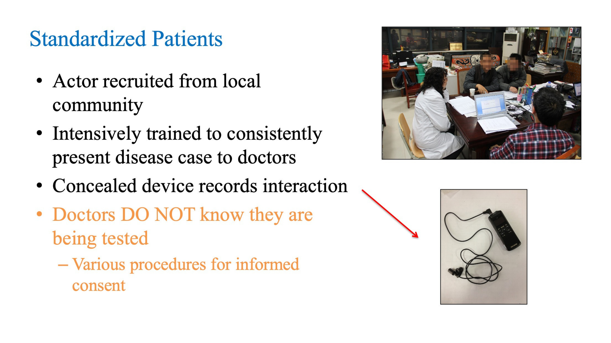
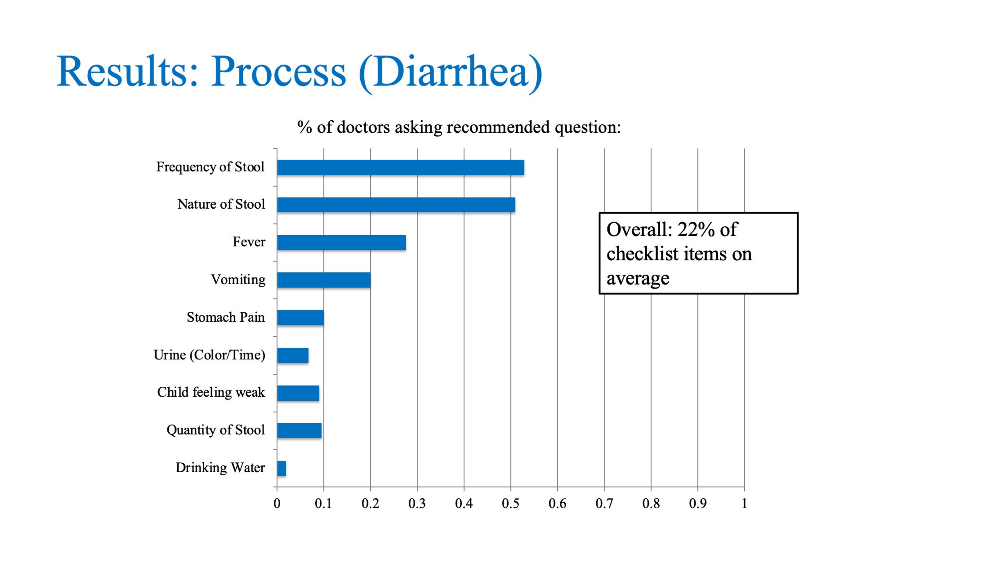
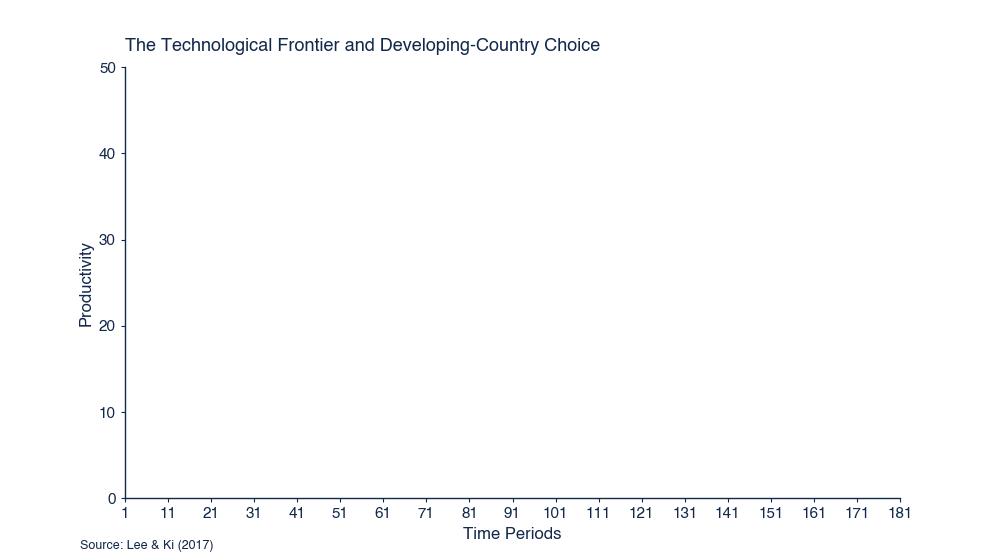
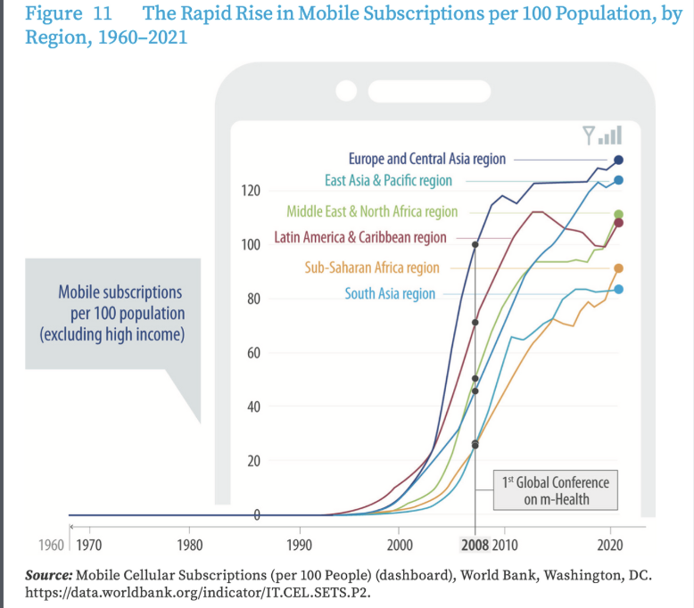
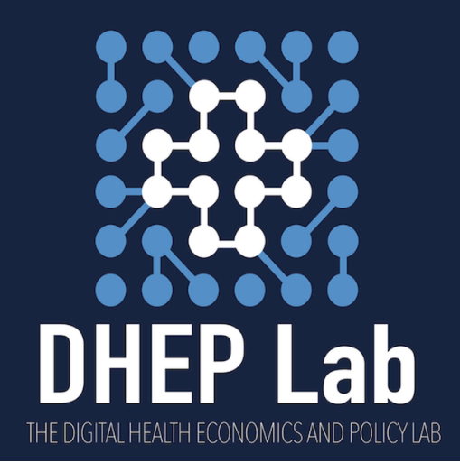
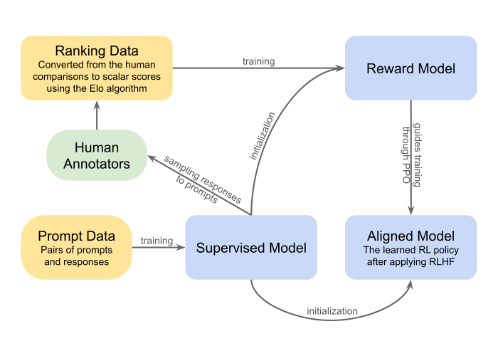
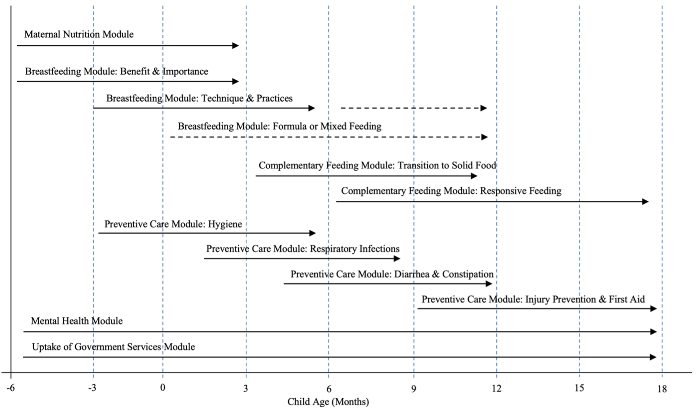

## About me {visibility="hidden"}
<!-- Placeholder; not shown. -->

## Roadmap

::: columns
::: {.column width="55%"}

1. **Why primary care quality** still limits health gains in LMICs
2. **Economics of digitization** in health
3. **Leapfrogging** and learning health systems
4. **Sociotechnical** risk
5. **Where innovation happens** — and where the data do not
6. **DHEP Lab:** four deep dives
7. **Takeaways**

:::
::: {.column width="45%"}

> The core thread: digital technology changes the *cost structure* of care delivery — which creates openings, but only under the right design.

:::
:::

::: {.notes}
Frame the talk: the old quality problem hasn't gone away; digitization shifts costs in ways that could finally move it — but not automatically. Four projects show how we try to translate that shift into real system change.
:::

# Part 1 · Primary care quality in LMICs {.center}

## Access was the old problem. Quality is the new one.

::: columns
::: {.column width="55%"}

- Decades of gains on **coverage, inputs, and access**
- Mortality and morbidity now increasingly driven by **what happens inside the consultation**
- In rural China, India, Kenya: clinicians know more than they do
- "**Kan bing nan, kan bing gui**" — hard to see a doctor, expensive to see a doctor — now joined by: *and the visit itself may not help*

:::
::: {.column width="45%"}

::: fragment
::: {.callout-important}
**Kruk et al., Lancet 2018:** poor-quality care kills more people in LMICs than lack of access does.
:::
:::

:::
:::

::: {.notes}
Set up the audience's mental model: in global health econ the field moved from Alma-Ata access framing to a quality framing. Lancet Global Health Commission on High Quality Health Systems is the canonical reference.
:::

## The three-gap framework

**Where does care go wrong?**

::: columns
::: {.column width="33%"}

::: fragment
### 1. Structural gap
What providers **have available** — drugs, equipment, infrastructure.
:::

:::
::: {.column width="33%"}

::: fragment
### 2. Knowledge gap
What providers **know** — trained skills, diagnostic reasoning.
:::

:::
::: {.column width="33%"}

::: fragment
### 3. Know-do gap
What providers **actually do** with patients — effort, attention, adherence to protocol.
:::

:::
:::

::: fragment
**Leonard, Das, and colleagues** show the know-do gap is often the biggest — and the least addressed by traditional training or equipment investments.
:::

::: {.notes}
Leonard & Masatu (health economics papers on Hawthorne effects and provider effort in Tanzania); Das, Hammer, and Leonard 2008 JEP "The Quality of Medical Advice in Low-Income Countries"; Mohanan et al. on vignettes vs. practice; also Das & Hammer Annual Review of Economics 2014.
:::

## Measuring what providers *actually do*: standardized patients {.smaller}

::: columns
::: {.column width="55%"}

- Actors recruited from local communities, trained to present identical disease cases
- Concealed audio recording of the consultation
- **Providers do not know they are being tested** — eliminates Hawthorne effect
- Gold standard for measuring provider *practice* (not just knowledge)

::: {.callout-note}
We've run SP studies across **rural Sichuan, Shaanxi, Anhui** — 21 counties, 439 facilities, 209 village clinics, township health centers, county hospitals.
:::

:::
::: {.column width="45%"}

{fig-alt="Photos from standardized patient training and recording sessions in rural China clinics" width="100%"}

:::
:::

::: {.notes}
This is the methodology my group pioneered in China — build on Das & Hammer's original work in India. Note SP passes as gold standard because we directly observe practice, not recall or perception.
:::

## What we find: the know-do gap is real and large {.smaller}

::: columns
::: {.column width="45%"}

**Childhood diarrhea at township health centers:**

- Providers complete **22%** of recommended history/exam items on average
- **Correct treatment** (ORS + zinc) given in a minority of cases
- Antibiotics widely prescribed where inappropriate

::: fragment
::: {.callout-important}
Pattern repeats for TB, pediatric fever, chest pain — **knowledge exceeds practice**, and the gap widens at lower tiers.
:::
:::

:::
::: {.column width="55%"}

{fig-alt="Horizontal bar chart showing proportion of providers asking each recommended question during diarrhea consultations, ranging from about 55% for frequency of stool down to under 5% for drinking water. Overall 22% of checklist items on average." width="100%"}

:::
:::

::: {.notes}
Cite Sylvia et al. BMJ Global Health on diarrhea; Sylvia et al. Bulletin of the WHO on TB detection at township level; also mention antibiotic prescribing work.
:::

## Beyond the clinic: CHWs and public-health delivery

::: columns
::: {.column width="55%"}

- Curative primary care is only part of the picture
- Much of the effective LMIC health gain runs through **community health workers** and public-health programs
  - Home visiting, nutrition, maternal and child health
  - Screening, behavior change, adherence support
- Same underlying problem shows up: **variability in what CHWs actually deliver**

:::
::: {.column width="45%"}

::: fragment
::: {.callout-note}
Large health-worker workforce + short visits + heterogeneous needs → high-variance delivery and a natural target for decision support.
:::
:::

:::
:::

## So why keep trying?  Because the cost structure is changing.

::: columns
::: {.column width="60%"}

- Traditional levers — training, supervision, P4P — produce **modest, fragile gains**
- We've hit the ceiling of what in-person, high-variable-cost delivery can do
- **Digitization shifts the cost curve** for information, measurement, and feedback — the inputs quality improvement actually depends on

:::
::: {.column width="40%"}

::: fragment
➡️ *That is the economic claim we'll interrogate for the rest of this talk.*
:::

:::
:::

# Part 2 · The economics of digitization in health {.center}

## Five cost reductions from digitization (Goldfarb & Tucker) {.smaller}

| Cost type | What digitization changes | Healthcare application |
|---|---|---|
| **Search** | Costless discovery of information and matches | Literature, symptom lookup, provider match |
| **Replication** | Near-zero marginal cost of digital goods | Training content, CDS models at scale |
| **Transportation** | Information no longer needs to move physically | Telemedicine, remote monitoring |
| **Tracking** | Cheap observation of behavior and outcomes | Continuous surveillance, adherence, RPM |
| **Verification** | Trust is built through data rather than gatekeepers | Digital IDs, reputation, provenance |

::: {.notes}
Goldfarb & Tucker 2019 "Digital Economics" JEL. This is the single most useful framework for the talk — each of our projects attacks one of these cost reductions.
:::

## AI adds a sixth: the cost of *prediction*

> *"Prediction machines: the simple economics of artificial intelligence."* — Agrawal, Gans, Goldfarb 2018

::: columns
::: {.column width="55%"}

- AI lowers the price of a specific input: **prediction**
- As prediction gets cheaper, its **complements** become more valuable: judgment, data, action
- In health: triage, diagnosis, risk stratification, targeting

:::
::: {.column width="45%"}

::: fragment
::: {.callout-tip}
**Consequence for LMICs:** the scarce input — specialist judgment — can be augmented by cheap prediction closer to the patient.
:::
:::

:::
:::

## Health datanomics: mapping cost reductions to delivery

| Cost reduction | Delivery application |
|---|---|
| Search | Information symmetry across patient–provider |
| Replication | Free curriculum for every CHW on every visit |
| Transportation | Care without the commute |
| Tracking | Personalization from routine data |
| Verification | Trust without expensive credentialing |
| **Prediction** | **Decision support at the edge of the system** |

# Part 3 · Leapfrogging and learning health systems {.center}

## The generational frontier of technology

**Three generations, one frontier** (Lee & Ki 2017)

- Each generation of technology plateaus
- The frontier moves when a new generation arrives

::: fragment
**HICs** climb slowly through all three — constrained by sunk costs (fax machines in US hospitals).
:::

::: fragment
**LMICs** can *skip* generations — or stall. Leapfrog is an **option**, not a destiny.
:::

::: {.notes}
Lee & Ki 2017 generational frontier framework; link to WEF 2015 4IR framing and the Healthy China 2030 / INSEAD-WIPO patents chart showing China on the leapfrog trajectory. Walk the class through the idea verbally before the next slide reveals the figure.
:::

## {#frontier-visualization background-color="white"}

{fig-alt="Animated chart building the Lee and Ki 2017 technological frontier framework: three generation S-curves rise and plateau, a yellow dashed technological frontier sweeps across their envelope, the high-income country growth path follows behind, and at present day two developing-country options diverge — Option 1 catches up sequentially through each generation while Option 2 leapfrogs directly to Generation 3." width="90%" fig-align="center"}

::: {.notes}
Full-screen visualization of the leapfrog concept. Let it play through once silently, then narrate: "Each generation plateaus. The frontier moves with each new generation. HICs climb behind the frontier. At present day, a developing country faces a choice — catch up through the old generations, or jump to the frontier."
:::

## Precedent: mobile adoption in LMICs

::: columns
::: {.column width="50%"}

- Most LMICs **never built landline infrastructure** at scale
- Jumped directly to mobile — then to mobile money (M-Pesa)
- Same pattern now unfolding for **e-health, HIS, telehealth**

::: fragment
::: {.callout-note}
The leapfrog opportunity is about **redesigning the system**, not importing it.
:::
:::

:::
::: {.column width="50%"}

{fig-alt="Line chart showing mobile cellular subscriptions per 100 population from 1960 to 2021, with all LMIC regions rising sharply after 2000 and reaching 80 to 130 subscriptions per 100 by 2021. The 1st Global Conference on m-Health is marked at 2008." width="100%"}

:::
:::

## The opportunity: learning health systems by design

- Traditional quality improvement is **slow, expensive, and local** — each improvement requires its own study
- Digitization makes three things cheap **simultaneously**:
  - Running interventions at scale
  - Measuring outcomes close to delivery
  - Updating decisions based on what's measured
- **The economic ingredients for a learning health system already exist in LMIC contexts.** The question is whether we build them intentionally.

::: fragment
> The frontier is designing systems that *learn* — not just systems that *digitize*.
:::

# Part 4 · Sociotechnical risk {.center}

## Technical validation ≠ real-world success {.smaller}

| System | Scope | Key failure | Impact |
|---|---|---|---|
| **Epic Sepsis Model** | 56% of US hospitals | Missed 67% of cases; 88% false alerts | Delayed treatment, alert fatigue |
| **IBM Watson Oncology** | Global, major cancer centers | Unsafe treatment suggestions | $62M+ sunk, quietly discontinued |
| **SkinVision** | Consumer melanoma detection | 235% worse with image rotation | Missed diagnoses, disparities |
| **COMPAS** | 46 US states (criminal justice) | 44.9% vs. 23.5% false-positive rates | Systemic racial bias |

::: fragment
**Each case passed technical benchmarks — and failed on deployment.**
:::

## Digital health = data ⇒ decisions ⇒ systemic risk

::: columns
::: {.column width="50%"}

### Barriers
- High fixed costs (infrastructure, data systems)
- Human capital and digital literacy
- Interoperability and governance

:::
::: {.column width="50%"}

### Risks
- Uncertain returns relative to existing tech
- Short-run vs. long-run tradeoffs
- **Systemic risk:** digital health *is* data, and data drives decisions — errors propagate at system scale

:::
:::

::: fragment
➡️ *Smart design of the sociotechnical system — not just the algorithm — is the core engineering problem.*
:::

# Part 5 · Innovation geography and data deserts {.center}

## Where innovation happens ≠ where the need is

::: columns
::: {.column width="50%"}

### Capital and R&D
- **>90%** of clinical AI trained on HIC data
- **<3%** of clinical AI datasets represent African populations
- **74%** of published AI studies use US or China data only
- Only **27 of 194** WHO countries have unified national EHR systems

:::
::: {.column width="50%"}

### EHR adoption
- US physicians: **78%** (2021)
- LMICs: **<15%** broad adoption
- LMIC **data deserts** reflect the absence of the very infrastructure that produces AI training data

:::
:::

::: {.notes}
RLEF deck is the source. Connect to "inverse care law of data": the populations with the greatest potential to benefit have the least representation in the models.
:::

## The paradox: implementation lives in LMICs; evaluation does not

- **Implementation innovation is often in LMICs** — CHW platforms, task-shifting models, AI deployed closer to the patient
- But **evaluation capacity, funding, and evidence** stay concentrated in HIC institutions
- The result is an evidence gap that *widens* as deployment accelerates

::: fragment
::: {.callout-important}
This is the gap DHEP Lab was built to close.
:::
:::

# Part 6 · DHEP Lab: four deep dives {.center}

## Digital Health Economics and Policy Lab

::: columns
::: {.column width="55%"}

**Three focus areas:**

1. **Telemedicine** — substitute or complement; platform economics of care
2. **Precision public health** — personalization at population scale
3. **AI in healthcare** — economic design of prediction-based tools

**Method:** economic theory + field experiments + policy translation, with partners in China, Ghana, Kenya, Ethiopia, and the US.

:::
::: {.column width="45%"}

{fig-alt="DHEP Lab logo" width="85%"}

::: {.callout-note}
**dhep.org** — projects, papers, team.
:::

:::
:::

## Portfolio: what we're working on

- **Quality measurement with SPs** — primary care, TB, HIV, antibiotic stewardship
- **RLEF-DataGen** — synthetic clinical data for underserved populations *(deep dive →)*
- **Healthy Future 2.0** — AI-enhanced CHW curriculum delivery *(deep dive →)*
- **Ethiopia Clinical Training (CG)** — deliberate-practice CME platform *(deep dive →)*
- **Collective Sentinel** — information markets for disease surveillance *(deep dive →)*
- Telemedicine substitution effects (China online hospitals)
- AI-assisted diagnosis field experiments
- Labor market effects of digital platforms on physicians

::: fragment
➡️ **Four deep dives** next — each targets a different cost reduction from Part 2.
:::

## Deep dive 1 · RLEF-DataGen {.smaller}

**The problem:** most LMIC populations have no EHR footprint — AI models cannot be trained *or* validated on the groups who need them most.

::: columns
::: {.column width="55%"}

**Reinforcement Learning with Expert Feedback:**

- Local clinicians generate and critique synthetic cases
- Model learns to produce distributions *experts recognize as locally plausible*
- Addresses the **validation paradox** of synthetic data — no ground-truth dataset required
- Gillings Innovation Lab funded; piloting with Ethiopian and Kenyan clinicians

::: {.callout-tip}
**Cost reduction targeted:** *replication* and *verification* — trustworthy training data where none exists.
:::

:::
::: {.column width="45%"}

{fig-alt="Schematic of reinforcement learning with human feedback loop: generator model proposes outputs, human expert ranks or edits, reward model learns expert preferences, generator is updated via policy optimization." width="100%"}

:::
:::

::: {.notes}
RLHF vs RLEF: RLHF aligns to preferences; RLEF transfers competence from experts. Key methodological distinction.
:::

## Deep dive 2 · Healthy Future 2.0 {.smaller}

::: columns
::: {.column width="55%"}

**HF 1.0 (cluster RCT, rural China, 119 townships, 1,306 families):**

- Stage-based CHW curriculum via tablet app
- **Positive effects:** dietary diversity, complementary feeding, maternal MH, caregiver knowledge
- **Null:** hemoglobin, exclusive breastfeeding
- **Strongest gains: pregnancy-entry families**

**HF 2.0 — the redesign:**

- *Stage-based* → **circumstances-based** personalization
- Short-term signals act as **surrogate indices** for long-run child health (Athey et al. 2019)

:::
::: {.column width="45%"}

{fig-alt="Figure showing Healthy Future program design with stage-based modules delivered by community health workers using the CareLoom app across pregnancy through 18 months of age." width="100%"}

::: {.callout-tip}
**Cost reductions targeted:** *tracking* + *prediction* — personalization with a fast learning loop.
:::

:::
:::

## Deep dive 3 · Ethiopia Clinical Training {.smaller}

::: columns
::: {.column width="55%"}

**Addressing the know-do gap with deliberate practice:**

- Case-based mobile CME platform for Ethiopian clinicians
- 5–10 minute structured cases with **immediate expert feedback**
- Adaptive case selection from calibration-weighted ability estimates
- Partnership with **Adwa Partners** — licensed to issue CPD credits through the Ethiopian Medical Association (30 credits/year mandatory)

**Why it can work:**

- Deliberate-practice meta-analytic effect on clinical competence: **d ≈ 0.71** (McGaghie 2011)
- Ethiopia: **1.23 physicians / 1,000** (WHO target 2.3); 85% rural — a textbook case for scalable deliberate practice

:::
::: {.column width="45%"}

::: {.callout-tip}
**Cost reductions targeted:** *replication* (curriculum) and *tracking* (per-clinician learning trace).
:::

:::
:::

## Deep dive 4 · Collective Sentinel (information markets) {.smaller}

::: columns
::: {.column width="55%"}

**Prediction markets for disease *nowcasting*:**

- Participants trade virtual stocks whose payoffs are tied to official disease statistics
- **LMSR** market mechanism aggregates dispersed local observations automatically
- Not forecasting — **nowcasting:** *what is happening now?*
- **Ghana pilot (JMIR Infodemiology 2024):** acceptable, feasible; digital-native participants most engaged
- **Kenya (CFK Africa):** custom Collective Sentinel platform, LMSR + M-Pesa payouts

:::
::: {.column width="45%"}

::: {.callout-tip}
**Cost reductions targeted:** *search* and *verification* — surveillance without representative sampling or lab infrastructure.
:::

::: fragment
**Frontier extensions:** AMR surveillance in US clinical settings (NIH/NIAID direction).
:::

:::
:::

::: {.notes}
LMSR = Logarithmic Market Scoring Rule (Hanson). Market price is an incentive-compatible belief aggregator — the design buys you scalability without requiring a representative sample.
:::

## Threads across the four {.smaller}

| Deep dive | Cost reduction exploited | What the design is really buying |
|---|---|---|
| RLEF-DataGen | Replication + verification | Training data where none exists |
| Healthy Future 2.0 | Tracking + prediction | Personalization in a slow-outcome setting |
| Ethiopia CME | Replication + tracking | Closing the know-do gap at scale |
| Collective Sentinel | Search + verification | Cheap surveillance without representative panels |

::: fragment
**Common move:** use digitization to cheaply generate the *feedback signal* a learning health system needs.
:::

# Takeaways {.center}

## Three things to hold onto

::: columns
::: {.column width="33%"}

### 1
The **quality problem** in LMIC primary care is a *behavior* problem as much as a resource problem.

:::
::: {.column width="33%"}

### 2
Digitization changes **which costs bind** — search, replication, tracking, verification, prediction. That's where the leverage is.

:::
::: {.column width="33%"}

### 3
**Sociotechnical design** — not the model — is the binding constraint on turning that leverage into system-level impact.

:::
:::

::: fragment
*The work of a digital health economist in LMICs: match the right cost reduction to the right delivery problem — and build the feedback loop that lets the system learn.*
:::

## Thank you

::: columns
::: {.column width="60%"}

**Sean Sylvia, PhD**
Associate Professor, Health Policy & Management
Director, Digital Health Economics and Policy Lab
UNC Gillings School of Global Public Health

📧 **sean.sylvia@unc.edu**
🌐 **dhep.org**

::: {.callout-note}
Partners across these projects: Stanford REAP, CFK Africa, Adwa Partners, Ethiopian Medical Association, UNC Eshelman School of Pharmacy, and field teams in China, Ghana, Kenya, and Ethiopia.
:::

:::
::: {.column width="40%"}

::: {style="text-align: center; padding-top: 1em;"}

{fig-alt="QR code linking to dhep.org" width="60%" .no-shadow}

**Scan for DHEP Lab**
`dhep.org`

:::

:::
:::
