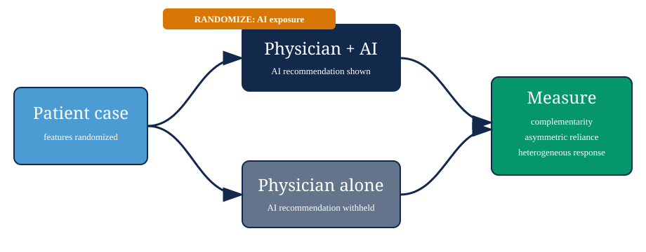
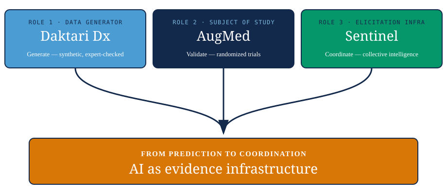

## The lab, and the problem {.smaller}

::: {.eyebrow}
DHEP LAB · THE THROUGH-LINE
:::

The **Digital Health Economics & Policy Lab** works on better health
decisions — coordinating **evidence, behavior, and systems**.

AI's first wave was **prediction**. The harder problem is
**coordination**: how we *generate, validate, and aggregate* knowledge
when there's no clean answer to check against.

> Epidemiology already lives this — imperfect gold standards, noisy
> surveillance. **AI sharpens the problem; it doesn't escape it.**

**When ground truth is scarce or contested, what should AI do?**
Three projects, three roles.

::: {.notes}
[~45 sec] One slide does double duty — lab identity *and* the problem.
Land the prediction→coordination move early; it's the title's promise.
Keep the epi anchor (this room lives the no-gold-standard problem) so the
AI question reads as familiar, not foreign. Don't enumerate the projects
yet — name the shared problem so the three slides feel like one argument.
Transition: "First role — AI as the thing that *makes* the data."
:::

## Daktari Dx — AI as **data generator** {.smaller}

::: {.eyebrow}
ROLE 1 · DATA GENERATOR
:::

::: {.statstrip}
::: {.stat}
::: {.num}
&gt;90%
:::
::: {.lab}
of clinical-AI training data comes from high-income settings
:::
:::
::: {.stat}
::: {.num}
&lt;3%
:::
::: {.lab}
represents African populations
:::
:::
::: {.stat}
::: {.num}
30,576
:::
::: {.lab}
clinical-AI papers analyzed to document the gap
:::
:::
:::

::: {.srcnote}
Celi et al., *PLOS Digital Health* (2022)
:::

:::: {.columns}

::: {.column width="55%"}
**The validation paradox:** you can't check synthetic data against the
real data that doesn't exist. So **expert judgment *is* the ground truth.**

**Daktari Dx** runs an **RLEF** loop — expert clinicians validate
AI-generated clinical vignettes *before* they enter training or evaluation
corpora. RLHF learns what people *like*; RLEF learns to do what experts
*do*.
:::

::: {.column width="45%"}
::: {.callout-note}
### AI's role
Generating *and* filtering synthetic clinical encounters, with expert
feedback as the validation loop.
:::
:::

::::

::: {.statusline}
**Status:** Kibera pilot with **CFK Africa** (≈250k residents, 20+ yr
partner) · Phase 1 complete — 10 clinicians interviewed, mobile-first
elicitation UI · Funder: **Gillings Innovation Lab**
:::

::: {.notes}
[~75 sec] Lead with the stat strip — the data-desert numbers are the hook.
Then the validation paradox: you can't check synthetic data against real
data you don't have, so expert judgment *is* the ground truth. The RLHF vs
RLEF line is the one-sentence methods contribution — say it slowly.
Transition: "In the next project AI isn't the data source — it's the thing
under the microscope."
:::

## AugMed — AI as **subject of study** {.smaller}

::: {.eyebrow}
ROLE 2 · SUBJECT OF STUDY
:::

> **Setting: colorectal-cancer screening recommendations** — where
> "correct" is genuinely contested: guideline-concordant ≠
> patient-appropriate ≠ cost-effective.

{fig-align="center" width="84%"}

Randomizing **AI exposure** *and* **patient features** gives a clean
causal estimate of physician–AI complementarity — the *team* is the
object of study, not the model alone.

::: {.statusline}
**Status:** NIH **AIM-AHEAD** partnership · two papers in progress —
**medical** (*PLOS Digital Health*, CRC screening) and **econ**
(*Management Science*, reliance + heterogeneity)
:::

::: {.notes}
[~70 sec] Make clear up front this is *colorectal-cancer screening*, not
generic AI — the contested-truth point is concrete: guideline-concordant,
patient-appropriate, and cost-effective are three different targets. Lean
on the randomized design — this room respects a clean experiment, and the
randomization is *how* we get a defensible answer with no single gold
standard. Transition: "Third role — AI not as data, not as subject, but as
infrastructure for getting at truth that lives in experts' heads."
:::

## Sentinel — AI as **elicitation infrastructure** {.smaller}

::: {.eyebrow}
ROLE 3 · ELICITATION INFRASTRUCTURE
:::

:::: {.columns}

::: {.column width="55%"}
**The structure is one you know:** in credence-good markets, quality is
hard to observe even *after* the fact — exactly like syndromic
surveillance, where there's no clean gold standard, just dispersed noisy
signals.

**Sentinel** is a **prediction-market + AI** platform that turns dispersed
expert and community judgment into **collective intelligence** — a
cost-effective community-level signal of disease *and* socioeconomic
trends.
:::

::: {.column width="45%"}
::: {.callout-note}
### AI's role
Coordination infrastructure — AI elicits and aggregates dispersed
judgment at scale, rather than substituting for it.
:::
:::

::::

::: {.statusline}
**Why this room:** participatory surveillance reframed as mechanism
design — the closest of the three to core epidemiologic practice
:::

::: {.notes}
[~70 sec] This is the slide that should land hardest here — it's literally
epidemiological surveillance. Anchor on the analogy: credence goods behave
like syndromic surveillance — no clean gold standard, only dispersed noisy
signals. The point is the *pattern*, not the platform internals.
Transition into the synthesis: "Step back and the three line up."
:::

## One problem, three roles {.smaller}

::: {.eyebrow}
SYNTHESIS
:::

{fig-align="center" width="92%"}

::: {.fragment}
Prediction is table stakes. When ground truth is scarce or contested, the
lab's contribution is the **coordination layer** — generate, validate,
aggregate. **AI as evidence infrastructure.** That's the thesis to reuse
in grants and fundraising.
:::

::: {.notes}
[~30 sec] Payoff slide. The diagram carries the arc; land the fragment
slowly — "prediction is table stakes; the value is the coordination layer
— AI as evidence infrastructure." That's the reusable grant thesis. Then
go straight to the closing question.
:::

## Thank you {.smaller}

> **What standards should AI meet to shape health decisions?**

**Sean Sylvia** · ssylvia@email.unc.edu · dhep.unc.edu

**Funders / partners:** Gillings Innovation Lab · CFK Africa ·
NIH AIM-AHEAD Consortium

::: {.notes}
[~15 sec] Don't ask "questions?" — open with the standards question. It's
the live debate for an epi faculty: what bar should AI clear to enter a
health decision, and who sets it. Ties the three projects back to
evaluation as the common thread.
:::
